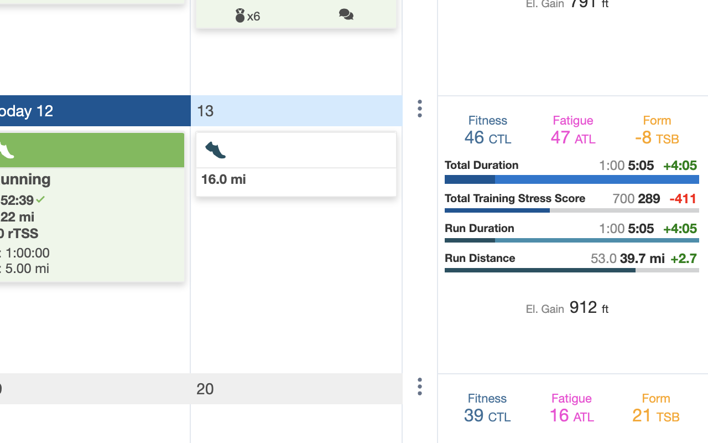

 

  

  <h3 align="center">TrainingPeaks Weekly Progress</h3>

  

    <a href="https://chrome.google.com/webstore/detail/training-peaks-weekly-progress">Chrome Web Store</a>
    ·
    <a href="https://github.com/tedbrakob/training-peaks-weekly-progress">Github</a>
  

 

Shows current weekly progress relative to planned values on TrainingPeaks calendar.

 

---

  

